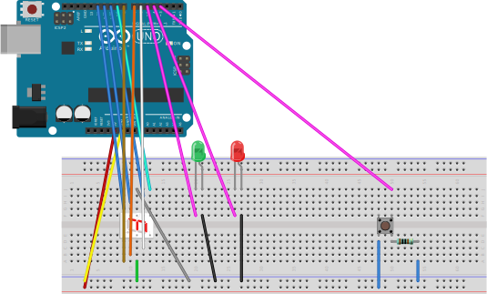

Juego Numérico en Arduino
=========================

En este pequeño pero entretenido juego deberemos dar al botón justo en el momento en que el número pedido aparece en la pantalla. Se adjunta el código en Processing y su diseño en Protoboard es similar a este:

